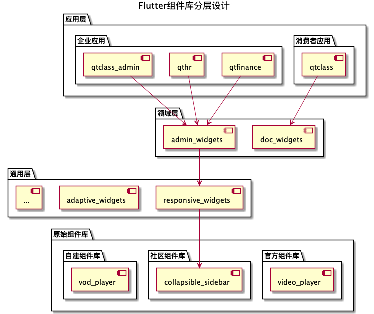

# Flutter组件库

## 分层设计

使用Flutter实现全平台的UI页面，最大的难点在于处理多设备、多尺寸的响应式和自适应问题。每个领域的应用还有自己的一套特定要求。因此，为了让开发者更方便地复用已有积累，我们把Flutter的组件库从底层到底层分为以下四层：
1. 应用层：Flutter应用。
2. 领域层：同类Flutter应用依赖的公共组件库和脚手架，比如管理后台组件库`admin_widgets`。
3. 通用层：处理响应式、自适应等通用问题。
4. 原始组件层：官方、社区和自建的组件和组件库。

关系如图所示。

## 常见问题的解决方案

## 主导航栏

主导航栏在手机端通常是底部导航栏、有时候是顶部Tab导航栏，在电脑端通常是顶部导航栏，适合导航项目只有几个主要部分的情况，或者适合主应用由较少数量的子应用集成的情况。

### 侧边导航栏

侧边导航栏可以用于管理后台功能导航、文档目录等导航单元较多、普通的Mobile底部导航栏和Desktop头部导航栏无法使用的场景。如果在必要的时候可以作为主导航栏的二级导航栏使用。

在桌面端，侧边导航栏通常是展开的，一般也可以支持可伸缩以方便用户展开具体内容。

在手机端，侧边导航栏可以有两种方案：
- 收起成按钮，点击按钮展开。
- Material抽屉栏，右滑拉出。

具体实现方案为：
1. 在原始组件库里选择以上所需组件。
2. 在响应式组件库里实现响应式侧边导航栏组件。
3. 在管理后台组件库和文档组件库分别实现基于以上组件的二次定制组件和页面脚手架。
4. 在具体应用中使用组件。